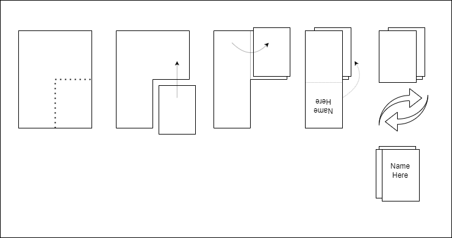

# Paranoia Creator

This is a creator for task cards for the game of Paranoia.

**NOTE** this is not a simple tool to use. There are probably easier ways to do organize a game of Paranoia. This is an over-engineered solution.

## What is Paranoia?

"Paranoia", also known as "Killers", KAOS (Killing As an Organized Sport), and other names probably, is a live-action role-playing game, where players take on a role of a killer, and have to assassinate their targets.
Apart from the target, in some variations you also get the "weapon" that you have to use (a non-pointy, non-stabby, non-hurty household item), and a location of the area you are in where you have to take out your target.
Once you complete that task, your "inherit" the target of the just-assassinated target, and the game goes until last player standing.

A requirement of the initial target distribution is that there must be a **single** loop of targetting. Otherwise, if there are multiple loops, the game cannot end with just one person remaining.

From a organizational perspective, this is an easy game to organise, as long as you have a game master -- a person that will create and distribute the initial targets, making sure everything is both correct (a single loop) and secret. But we don't want that, so this program does all of that. Plus makes it pretty and printable.

### Requirements

Requirements of this program are:

- The targets must be distributed on paper, since it is easier to distribute and keep track who has which target.
- The process of distributing the targets should involve no third-party, and should not reveal any information to people doing the distribution (including preparation).


## How to use

### 1. Preparing the data

1. Create a directory. This will be your root directory of the game.
2. Create a `paranoia.yml` file in the root directory. The structure is as follows:
    ```yml
    config:
      # printing configuration
    fields:
      # data fields configuration
    ```
3. Specify the fields for the game in the `paranoia.yml` file. E.g., if you are playing the "just target" version, you would specify:
    ```yml
    fields:
    - name: Target
      is_player: true
    ```
    Alternatively, if you are playing the target/weapon/location version, you would specify:
    ```yml
    fields:
    - name: Target
      is_player: true
    - name: Weapon
    - name: Location
    ```
4. Exactly one field needs to be marked `is_player: true` -- this is the actual player names. Other fields can be marked `can_skip` and `can_repeat` if they can be skipped (i.e. not picking all of them) or repeated.
5. Create `.txt` files in the root directory for each field. E.g., `Target` field would read from `Target.txt` file. The file should contain a single entry on each line. Empty lines are ignored.

## 2. "Organizing" the game

Run `python paranoia.py organize /path/to/root/dir`. Fix any issues it complains about until is succeeds. It should create a `.organization` file in the root directory. This file contains the target distribution. It is base64 encoded as a protection from "accidental viewing".

Configure the printing options of the game, in the `config` portion of the main config file. See later section for description.

Run `python paranoia.py print /path/to/root/dir`. This will create an `output.pdf` file in the current directory. This is the file you will have to print. It contains a blank page at the start, for your viewing protection.

## 3. Printing the targets

1. Gather as many A5 papers as there are players plus one. An A5 is a half of an A4. For US sizes, good luck.
2. Using a sharp knife, mark the **top middle** and **right middle** of all the papers. These will be useful later on, but should be easily visible from both sides of the paper. Best to actually cut a few mm of the paper, not just score it.
3. Print the output PDF on those papers. Once they are finished printing, take them out of the printer, but **DO NOT TURN THEM OVER**, keep them upside down (assuming a common printer that flips the pages as it prints).
4. The scores should now be on the **bottom middle** and **right middle**, and you are looking at the backside of all the printed pages.

The following should be done for each of the printed-out pages, without looking at them of course:

1. Using scissors, cut the **bottom right** quadrant of the page out. Use the previously made scores to help you. The cuts don't have to be super precise. This is the quadrant that contains the target, and any additional fields.
2. Move the **cut out part** up, over the **top right** quadrant.
3. Fold the entire left half of the page over and right, wrapping the cut out part. You should now see the name (upside down).
4. Fold the lower part backwards, wrapping the rest.
5. Turn the bundle over lengthwise. You should see the name upright.

Take a look at the following illustration to make it even less clear:



## Printing Configuration Options

```

    cover_font_name: str = "Arial"
    cover_font_style: str = "B"
    cover_font_size: int = 20
    cover_line_spacing: str = 1.1

    field_font_name: str = "Arial"
    field_font_style: str = ""
    field_font_size: int = 10
    field_line_spacing: str = 1.1

    value_font_name: str = "Arial"
    value_font_style: str = "B"
    value_font_size: int = 12
    value_line_spacing: str = 1.1

    id_font_name: str = "Arial"
    id_font_style: str = "B"
    id_font_size: int = 8
    id_line_spacing: str = 1.1
    id_prefix: str = "Serial Number: "

    print_margin: int = 20
    print_fold_lines: bool = False
    
  ```